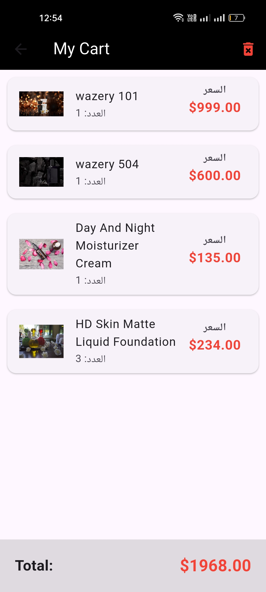
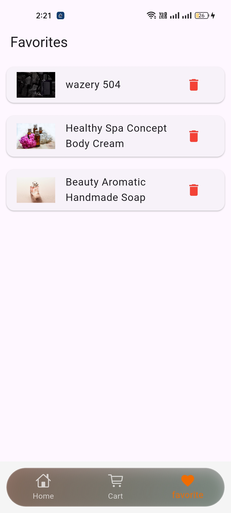

# WazeryShop - Perfume E-Commerce

**WazeryShop** is a Flutter-based **E-Commerce** app for buying perfumes online. It allows users to browse a wide range of perfumes, add products to their cart, and complete the purchase through a seamless checkout process.

## 🎯 Project Objective

The goal of WazeryShop is to provide users with a smooth and intuitive shopping experience for purchasing perfumes from a mobile app built with Flutter.

## 👤 About the Author

**Ibrahim Wazery**  
Founder of [wazery.net](https://wazery.net), a platform for all things related to perfumes and e-commerce solutions.

## 📱 App Screenshots

### Home Page

### Cart Page

### Single Product Page

### Checkout Page

### Checkout Page

